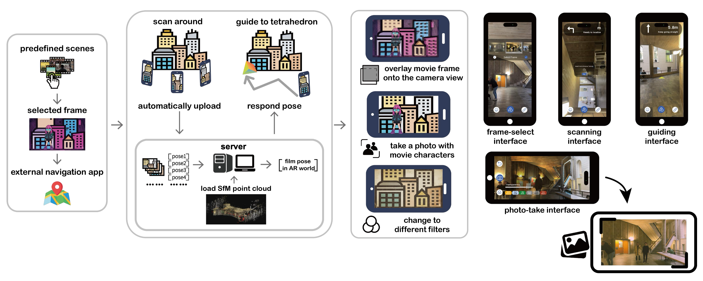

# AR Journey to Movie

## 1. Motivation & Project Description

**Abstract:**  Visiting real-world locations where iconic movie scenes were filmed offers a unique connection between cinematic storytelling and physical space. However, accurately
aligning original film frames with the real environment remains challenging due to scale ambiguity, viewpoint mismatch, and environmental changes over time.
**AR Journey to Movie** is an augmented reality (AR) system that enables users to recreate cinematic shots at their original filming locations using a mobile device.
By integrating server-side Structure-from-Motion (SfM) models with real-time mobile AR sessions, the system guides users to the correct camera viewpoint and overlays
original movie frames directly onto the live camera view. This allows users not only to stand at the original filming position, but also to capture photos and videos with
precise cinematic alignment.

The project focuses on robust camera localization, efficient server-side processing,
and intuitive AR guidance, demonstrating how computer vision and mobile AR can be
combined to bridge film history and physical experience.

You can find the project **paper** here: [link]  
You can find the project **demo video** here: [link]

This project was developed as part of the **Mixed Reality** (Fall Semester 2025)
course at ETH Zurich.

---

## 2. Project Organization

This repository contains two main components: a mobile AR application and a
server-side localization backend. Their responsibilities and interactions are
summarized below.

### 2.1 Mobile AR Application (Unity)

- Built with **Unity (C#)** and mobile AR frameworks (ARKit / ARCore)
- Handles user interaction, camera tracking, and AR session management
- Continuously captures camera frames and AR poses during scanning
- Uploads selected frames to the server asynchronously
- Visualizes navigation guidance and overlays original movie frames onto the live camera view
- Allows users to apply visual filters and capture cinematic photos

### 2.2 Server-side Localization Backend (Python)

- Implemented in **Python**
- Manages pre-built **SfM reconstructions** of filming locations
- Performs image retrieval and camera localization using a modified **HLoc pipeline**
- Estimates camera poses in the SfM coordinate frame
- Computes a **similarity transformation (sRt)** to align the SfM world with the mobile AR session
- Returns refined poses to the mobile client for accurate AR alignment

---

## 3. Core Application Flow

1. The user selects a predefined movie scene.
2. The mobile AR application guides the user to specific location by Google Maps and leads the user to scan the surrounding environment.
3. Camera frames and AR poses are uploaded to the server in the background.
4. The server localizes selected frames in the SfM model.
5. A similarity transformation aligns the SfM coordinate system with the AR session.
6. The original movie frame is overlaid onto the live camera view.
7. The user captures photos with cinematic alignment of optional functions (filters, movie characters).



---

## 4. Repository Structure
```text
AR-Journey-to-Movie/
├── unity-client/ # Unity mobile AR application
│ ├── Assets/
│ ├── Scenes/
│ └── Scripts/
│
├── server/ # Python backend
│ ├── sfm_models/
│ ├── query_sfm_pose.py/
│ ├── utils.py/
│ └── server_main.py
│
├── README_files/ # Figures used in README
└── README.md
```


